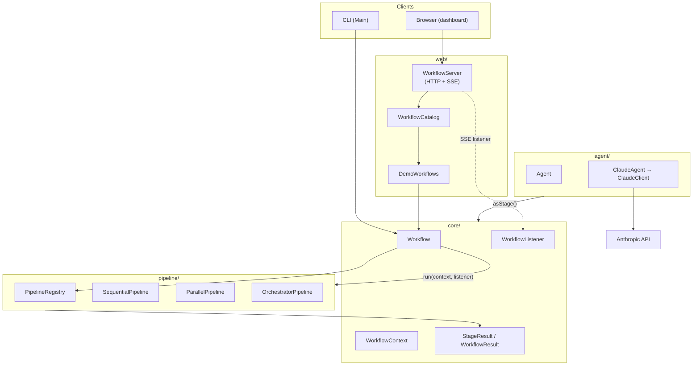
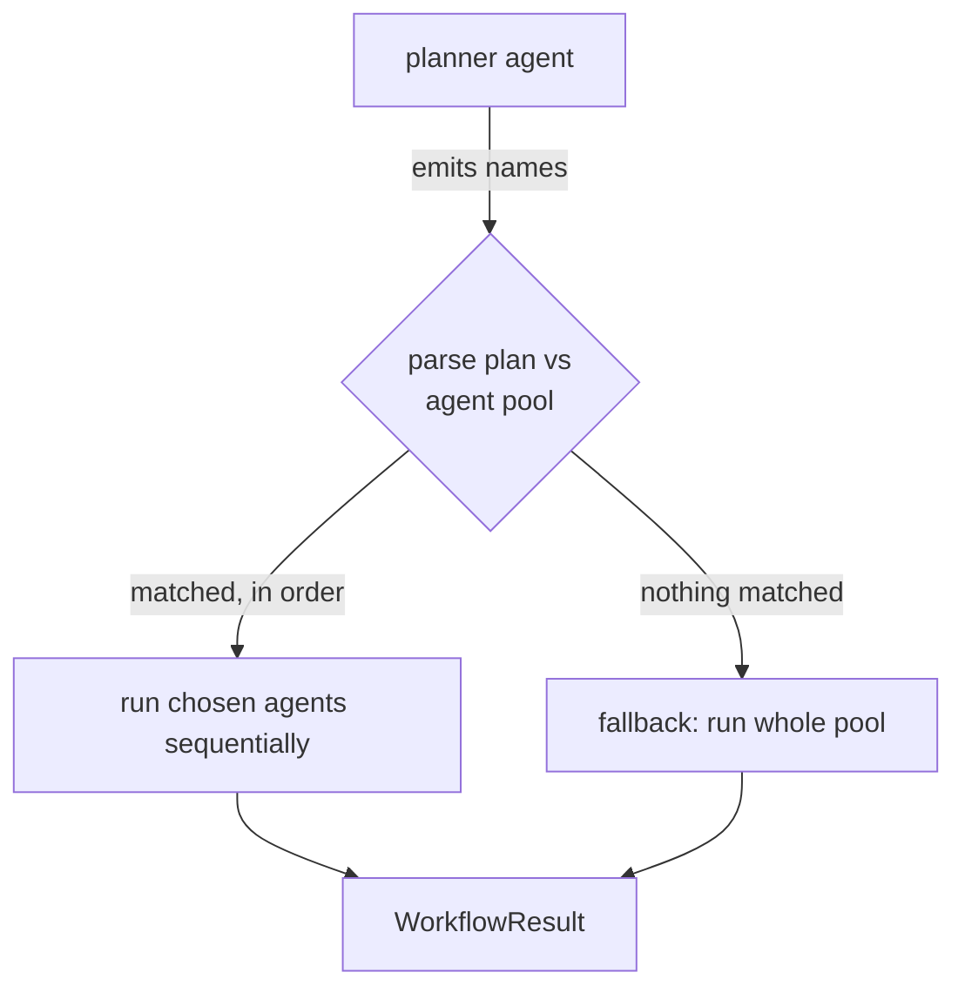
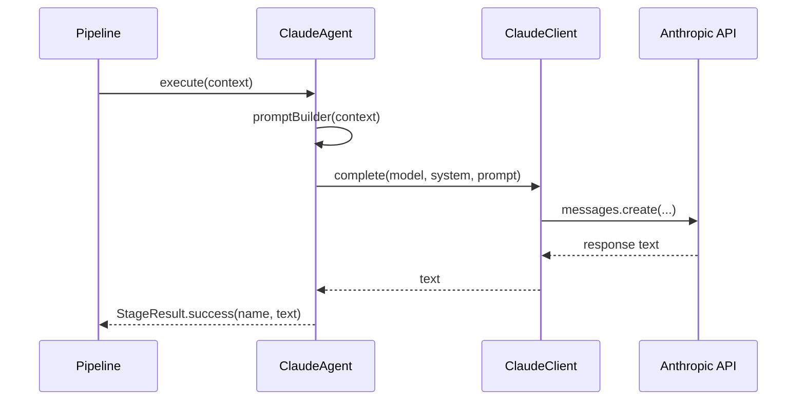

# Myriads Workflow — Design Document

**Status:** Living document · **Audience:** contributors and integrators · **Scope:** the engine, its agents, and the web portal.

This document explains *why* the system is shaped the way it is. For how to run it, see the [README](README.md).

---

## 1. Overview

Myriads Workflow is a starter for a **distributed agentic workflow** engine. A *workflow* is a named list of steps; a *pipeline* decides how those steps execute (in order, concurrently, or chosen at run time by an LLM); a *listener* observes the run as it happens. The same model that runs simulated demo steps runs real Claude-backed AI agents, and a built-in web portal renders any run live, stage by stage.

The codebase is intentionally small. Its value is the **set of seams** it establishes — `Stage`, `Pipeline`, `Agent`, `WorkflowListener` — each of which is an extension point that future work plugs into without disturbing the rest.

### 1.1 Goals

- **Pluggable execution.** Adding a new way to run steps (parallel, branching, distributed) is implementing one interface and registering it — never editing the steps themselves.
- **Uniform agents.** A hand-written step and an LLM agent are the same type to the engine, so either drops into any pipeline and the portal unchanged.
- **Observability by default.** Every run emits structured per-stage events; the portal is just one consumer of them.
- **Small, dependency-light core.** Java standard library where possible; third-party deps only where they earn their place (JSON, the Anthropic SDK).

### 1.2 Non-goals (today)

- Durable persistence / replay of runs (state is in-memory per run).
- Authentication, multi-tenancy, or rate limiting on the portal.
- A general DAG scheduler — pipelines are linear or fan-out, not arbitrary graphs (yet).
- Horizontal distribution across machines — the `Pipeline` seam is designed for it, but no remote dispatcher exists yet.

### 1.3 Technology choices

| Concern | Choice | Rationale |
|---|---|---|
| Language / build | Java 21, Maven | Virtual threads for fan-out; ubiquitous tooling |
| HTTP server | JDK `com.sun.net.httpserver` | Zero extra dependency for the portal |
| JSON | Jackson Databind | API responses and SSE payloads |
| LLM | Anthropic Java SDK (`claude-opus-4-8`) | Real AI agents |
| Logging | SLF4J + Logback | Standard, configurable |
| Tests | JUnit 5 | Standard |

---

## 2. Architecture



### 2.1 Package layout

```
com.myriads.workflow
├── Main                     # entry point: CLI demo · serve [port] · ai [goal]
├── core/                    # the engine contracts and data types
│   ├── Stage                # one unit of work
│   ├── StageResult          # SUCCESS | HALT | FAILED + output
│   ├── WorkflowContext      # thread-safe shared state for a run
│   ├── Workflow             # named stages + a chosen pipeline
│   ├── WorkflowResult       # aggregate run outcome
│   └── WorkflowListener     # per-run observer (powers the portal)
├── agent/
│   ├── Agent                # autonomous worker; asStage() adapter
│   ├── ClaudeAgent          # Agent backed by the Claude API
│   └── ClaudeClient         # thin Anthropic SDK wrapper
├── pipeline/
│   ├── Pipeline             # THE extension point — an execution strategy
│   ├── PipelineRegistry     # id → Pipeline lookup
│   ├── SequentialPipeline   # in order
│   ├── ParallelPipeline     # concurrent (virtual threads)
│   └── OrchestratorPipeline # planner agent chooses the path
└── web/
    ├── WorkflowServer       # embedded HTTP + SSE
    ├── WorkflowCatalog      # named workflows the portal exposes
    └── DemoWorkflows        # the bundled examples
```

### 2.2 Layering and dependency direction

`core` depends on nothing. `agent` and `pipeline` depend on `core`. `web` depends on all of them. Dependencies point inward; the core has no knowledge of HTTP, JSON, or Anthropic. This is what lets the engine be embedded, tested, or driven from a CLI without the web layer.

---

## 3. Core domain model

### 3.1 `Stage` and `StageResult`

A `Stage` is the smallest schedulable unit:

```java
@FunctionalInterface
public interface Stage {
    StageResult execute(WorkflowContext context) throws Exception;
    default String name() { return getClass().getSimpleName(); }
}
```

A stage returns a `StageResult` — a record carrying a status, an optional output payload, and an optional error:

| Status | Meaning | Effect on the run |
|---|---|---|
| `SUCCESS` | finished; output saved to context | continue |
| `HALT` | stop early, cleanly (e.g. awaiting human approval) | run ends, `completed = true` |
| `FAILED` | threw or returned failure | run aborts, `completed = false` |

These three outcomes are the engine's entire control-flow vocabulary. They map directly onto real workflows: `HALT` is a human-in-the-loop gate, `FAILED` is a safe abort that skips everything downstream.

### 3.2 `WorkflowContext`

Thread-safe shared state for a single run, backed by a `ConcurrentHashMap` (so parallel and future distributed pipelines can share it safely). Each stage reads its inputs and publishes its output under its own name; the next stage reads that key. This is the data-flow backbone — the planner → researcher → writer hand-off is just successive `ctx.get(...)` / `ctx.put(...)`.

### 3.3 `Workflow`

A named, immutable list of stages bound to one `Pipeline`, built fluently:

```java
Workflow.named("demo")
    .using(pipeline)
    .stage(plannerAgent.asStage())
    .stage(executorAgent.asStage())
    .build();
```

`Workflow` is execution-agnostic: swap the pipeline and the same stages run with different semantics. It exposes `stageNames()` (for the portal to render before a run) and `pipelineId()` (for the sequential/parallel/orchestrator badge), and it fires the workflow-level listener events.

### 3.4 `WorkflowListener`

The observability seam. All methods default to no-ops, so observers implement only what they need:

```java
interface WorkflowListener {
    void onWorkflowStarted(String runId, String workflowName, List<String> stageNames);
    void onStageStarted(String runId, String stageName);
    void onStageCompleted(String runId, StageResult result);
    void onWorkflowCompleted(WorkflowResult result);
    WorkflowListener NOOP = new WorkflowListener() {};
}
```

Callbacks fire synchronously on the running thread, in execution order. The portal implements this to stream SSE; metrics, tracing, or audit logging would implement it the same way. Crucially, adding the listener was **backward-compatible**: the original 2-arg `run(stages, context)` remained via a default method, so no existing caller or test changed.

---

## 4. Pipelines — the primary extension point

A `Pipeline` is a strategy for executing a list of stages:

```java
public interface Pipeline {
    WorkflowResult run(List<Stage> stages, WorkflowContext context, WorkflowListener listener);
    default WorkflowResult run(List<Stage> stages, WorkflowContext context) {
        return run(stages, context, WorkflowListener.NOOP);
    }
    String id();
}
```

New execution semantics are introduced by implementing this interface and registering it in a `PipelineRegistry` (keyed by `id()`). Three pipelines ship today.

### 4.1 `SequentialPipeline` (`sequential`)

Runs stages in declaration order. On each stage: fire `onStageStarted`, execute, publish output to context, fire `onStageCompleted`, then branch on status — `SUCCESS` continues, `HALT` stops with `completed = true`, `FAILED` aborts with `completed = false`. The reference implementation.

### 4.2 `ParallelPipeline` (`parallel`)

Runs every stage concurrently on **Java 21 virtual threads** (`Executors.newVirtualThreadPerTaskExecutor()`), then waits for all. Results are collected in declaration order regardless of completion order; the run is `completed = false` if any stage failed.

**Design constraint:** because stages run at once, ordering between them is undefined — a parallel stage must not depend on another's context output. Use it for *independent* work (parallel scans, multi-region deploys, an agent crew that doesn't share state). `HALT` can't cancel siblings already running, so it simply ends that one stage.

### 4.3 `OrchestratorPipeline` (`orchestrator`)

The agentic pipeline: the control flow is decided by the model at run time.



**Convention:** the first stage is the **planner**; the remaining stages form a named **agent pool**. The planner runs first; its text output is scanned for pool-agent names, and the matching agents run in order of first appearance. Pool agents the plan doesn't mention never run (the portal renders them *skipped*). If nothing matches, it falls back to the whole pool; a failed planner aborts before any agent runs.

**Parsing trade-off:** plan matching is by name occurrence, so pool names must be distinct and not substrings of one another (`researcher` vs `research`). This keeps the planner prompt simple (it just lists names) at the cost of a naming rule, documented on the class. A stricter structured-output approach (JSON schema) is a future option.

### 4.4 Why this is the seam for distribution

A future `DistributedPipeline` would implement the same interface: serialize each stage's work, dispatch to remote workers, collect results, and fire the same listener events. Nothing in `Workflow`, the agents, or the portal would change — they already speak `Pipeline` and `WorkflowListener`. The `WorkflowContext` being a concurrent map (rather than thread-local) is a deliberate down-payment on this.

---

## 5. Agents

### 5.1 `Agent` and the `asStage()` adapter

An `Agent` is an autonomous worker with a `name()` and an `act(context)` method. Its default `asStage()` adapts it into a `Stage`, so any agent drops into any pipeline:

```java
default Stage asStage() {
    return new Stage() {
        public StageResult execute(WorkflowContext ctx) throws Exception {
            return StageResult.success(Agent.this.name(), Agent.this.act(ctx));
        }
        public String name() { return Agent.this.name(); }
    };
}
```

The engine never distinguishes "a deterministic step" from "an LLM call" — both are `Stage`s. This uniformity is what made adding real AI agents a *new class*, not a *new code path*.

### 5.2 `ClaudeAgent` and `ClaudeClient`

`ClaudeAgent` implements `Agent`: it builds a prompt from the context, calls Claude, and returns the model's text as its output. `ClaudeClient` isolates the Anthropic SDK so no Anthropic type leaks into the rest of the engine.

Design decisions:

- **Lazy, shared client** keyed off `ANTHROPIC_API_KEY`. If the key is absent, `ClaudeClient.shared()` throws a clear, actionable error — which surfaces as a `FAILED` stage with a readable message in the portal, never a crash. The simulated workflows still run without a key.
- **Model default `claude-opus-4-8`**, overridable via `MYRIADS_MODEL`. Per Anthropic guidance, the default is the latest Opus tier; we don't downgrade for cost behind the user's back.
- **Prompt building is a `Function<WorkflowContext, String>`**, so an agent's input is composed from prior stages' outputs — this is how the crew chains and how orchestrator pool agents read the goal + plan.



---

## 6. Web portal

### 6.1 Server

`WorkflowServer` is built on the JDK's `HttpServer` (no web framework). Routes:

| Method & path | Purpose |
|---|---|
| `GET /` | the single-page dashboard (served from `resources/web/`) |
| `GET /api/workflows` | list workflows with stage names + pipeline id |
| `GET /api/workflows/{name}` | one workflow's definition |
| `POST /api/workflows/{name}/run` | run it, return the full result as JSON |
| `GET /api/workflows/{name}/stream` | run it, streaming live SSE events |

Both run endpoints accept `?goal=...`, seeded into the run's `WorkflowContext`.

### 6.2 Live streaming via SSE

The `stream` endpoint attaches a `WorkflowListener` that turns each engine callback into a Server-Sent Event (`started`, `stage-started`, `stage-completed`, `completed`). The browser's `EventSource` consumes them and transitions each stage card **pending → running → success / halt / failed**, marking never-started stages as *skipped* on completion (which is how the orchestrator's routing renders visually).

**Concurrency note:** under `ParallelPipeline`, listener callbacks fire from multiple threads onto one response stream. SSE frames are therefore written under a per-stream lock so they never interleave.

### 6.3 Dashboard

A dependency-free single page renders all workflows as cards on one screen, each runnable individually or via **Run all**, with a status legend and a sequential/parallel/orchestrator badge per card. Sequential pipelines draw a left-to-right track; parallel draws a concurrent group; the live animation conveys the difference.

---

## 7. Cross-cutting concerns

### 7.1 Concurrency model

- A workflow run is single-threaded under sequential/orchestrator pipelines; `ParallelPipeline` fans out to virtual threads and joins.
- `WorkflowContext` is a `ConcurrentHashMap` — safe for concurrent writes, though parallel stages should treat each other's outputs as unavailable.
- The HTTP server uses a small fixed thread pool; each SSE run holds one pool thread while the actual stage work (for parallel) runs on virtual threads.

### 7.2 Error handling

- Stage exceptions are caught by the pipeline and converted to `FAILED` results (never propagated raw) — one failing stage can't take down the run loop or the server thread.
- HTTP handlers are wrapped so any exception becomes a 500 instead of killing the worker.
- Missing API key is a typed, user-facing error, not a stack trace.

### 7.3 Configuration

| Variable | Purpose | Default |
|---|---|---|
| `ANTHROPIC_API_KEY` | enables Claude agents | — (required for AI workflows) |
| `MYRIADS_MODEL` | model id for `ClaudeAgent` | `claude-opus-4-8` |
| `serve [port]` arg | portal port | `8080` |

### 7.4 Testing strategy

Pipelines are tested deterministically with fake stages — including the orchestrator, whose routing/fallback/abort logic is verified **without any API call** (the planner is a plain stage returning a fixed plan string). This keeps the test suite fast, offline, and free.

---

## 8. Extensibility worked examples

| To add… | You write… | Nothing else changes because… |
|---|---|---|
| A new execution semantic | a `Pipeline` impl + register it | `Workflow` and the portal speak `Pipeline` |
| A new kind of agent | an `Agent` impl (e.g. tool-using, another LLM) | `asStage()` makes it a `Stage` |
| Metrics / tracing / audit | a `WorkflowListener` impl | runs already emit the events |
| A new demo / real workflow | a `Workflow` in `DemoWorkflows` | the catalog and portal enumerate it |

---

## 9. Roadmap

| Status | Item |
|---|---|
| ✅ | Parallel pipeline (`ParallelPipeline`) |
| ✅ | LLM-backed agents (`ClaudeAgent`) |
| ✅ | Planner-driven orchestration (`OrchestratorPipeline`) |
| ☐ | **Distributed execution** — dispatch stages to remote workers (implements `Pipeline`) |
| ☐ | Tool-using agents — give `ClaudeAgent` tools to call |
| ☐ | Persistence / replay of `WorkflowContext` and run history |
| ☐ | Branching pipeline — route on a classifier stage's output |
| ☐ | Iterative-refine pipeline — worker → critic → revise until approved |

---

## 10. Open questions

- **Distribution boundary.** Do remote workers receive serialized stage *definitions*, or call back into a registry by id? The latter avoids shipping code but needs a shared registry.
- **Context size over distribution.** A `ConcurrentHashMap` works in-process; a distributed run needs a serialization and size policy (and possibly compaction) for `WorkflowContext`.
- **Structured planner output.** Move `OrchestratorPipeline` plan parsing from name-occurrence to a JSON schema (Anthropic structured outputs) for robustness against free-text drift.
- **Backpressure.** The portal holds one server thread per active SSE run; a bounded run queue or async dispatch would be needed at higher concurrency.
