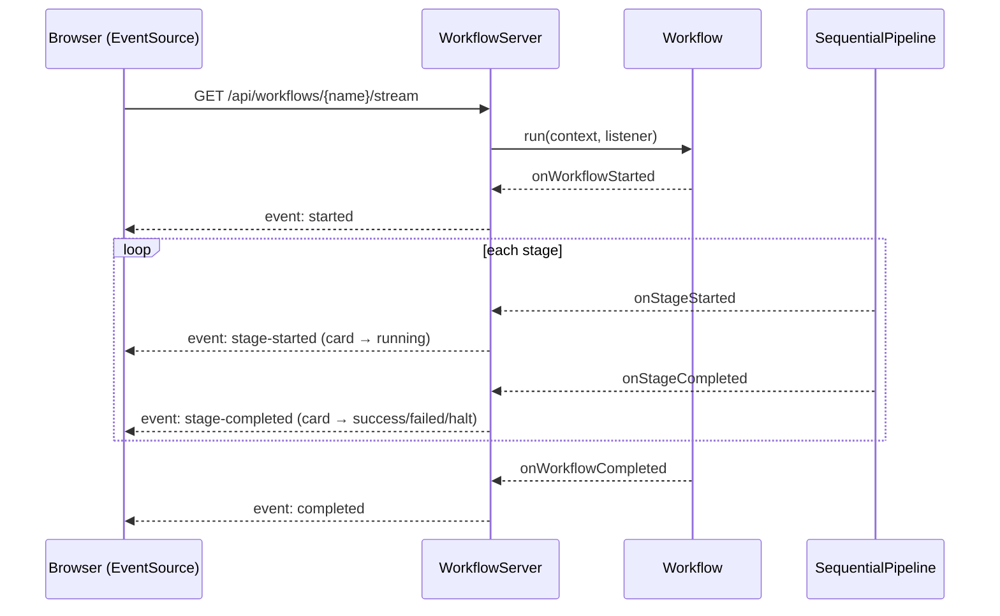
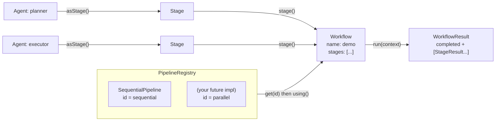
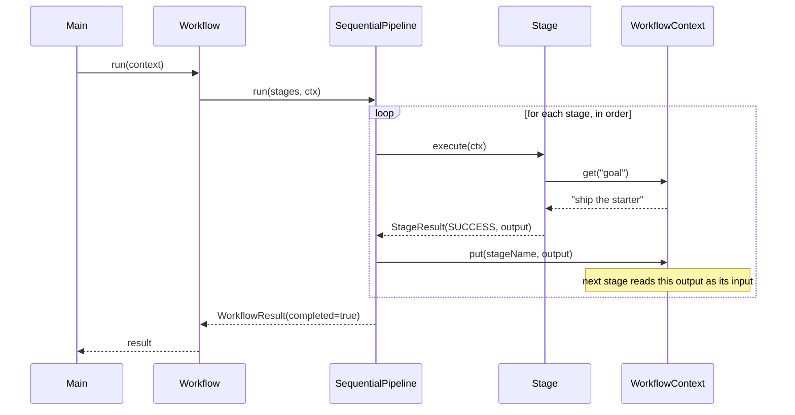
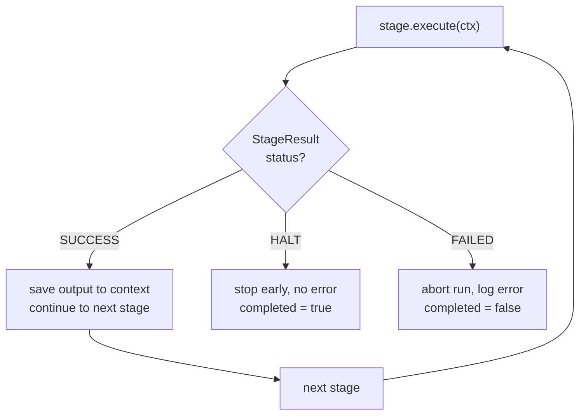

# Myriads Workflow

A starter for a **distributed agentic workflow** engine, built as a Java 21 / Maven application.

This repo intentionally ships a small, clean core. The execution model is pluggable so
new ways of composing and running pipelines can be added incrementally.

## Requirements

- Java 21+
- Maven 3.9+

## Build & run

```bash
mvn clean package          # compile, test, and build a runnable fat jar

# run the command-line demo:
java -jar target/myriads-workflow.jar

# or launch the web portal (see below) and open http://localhost:8080 :
java -jar target/myriads-workflow.jar serve 8080
```

Run straight from source instead of building a jar:

```bash
mvn -q exec:java                              # CLI demo
mvn -q exec:java -Dexec.args="serve 8080"     # web portal
```

Run the tests on their own:

```bash
mvn test
```

## Web portal

A small, dependency-light portal (built on the JDK's built-in HTTP server) lists the
available workflows and **runs them live, lighting up each stage as it executes**. Start
it with `serve [port]` and open <http://localhost:8080>.

When you run a workflow, the browser opens a [Server-Sent Events](https://developer.mozilla.org/docs/Web/API/Server-sent_events)
stream. The server attaches a `WorkflowListener` to the run and turns each engine callback
into an SSE event, so stage cards transition **pending → running → success / failed / halt**
in real time:



The three bundled demo workflows exercise every outcome — one all-green run, one that
**halts** for an approval gate, and one that **fails** on a flaky API call.

### HTTP API

| Method & path | Purpose |
|---------------|---------|
| `GET /api/workflows` | List workflows and their stage names. |
| `GET /api/workflows/{name}` | One workflow's definition. |
| `POST /api/workflows/{name}/run` | Run it, return the full result as JSON. |
| `GET /api/workflows/{name}/stream` | Run it, streaming live SSE events. |

Both run endpoints accept an optional `?goal=...` query param, which is seeded into the
run's `WorkflowContext`.

## Concepts

| Type | Responsibility |
|------|----------------|
| `Stage` | The smallest unit of work in a workflow. |
| `StageResult` | Outcome of a stage: `SUCCESS`, `FAILED`, or `HALT`, plus an output payload. |
| `WorkflowContext` | Thread-safe shared state passed through every stage of a run. |
| `Agent` | An autonomous worker; `asStage()` adapts it into a `Stage`. |
| `Pipeline` | **The main extension point** — a strategy for executing stages. |
| `PipelineRegistry` | Holds the available pipelines, selected by id. |
| `Workflow` | A named list of stages run by a chosen `Pipeline`. |
| `WorkflowListener` | Observes a run as it executes; powers the live web portal (and metrics/tracing). |

## How it works

The engine has one core idea: **a `Workflow` is just a list of stages plus a chosen
`Pipeline`.** Swap the pipeline and the same stages run with different semantics —
sequential today; parallel, branching, or distributed later. The three diagrams below
show the same system from three angles.

### 1. Structure — how the pieces relate

`Agent`s are adapted into `Stage`s and wired into a `Workflow`. The `Workflow` borrows
an execution strategy (`Pipeline`) from the `PipelineRegistry`, and running it produces a
`WorkflowResult`.



### 2. Execution — what happens on `workflow.run()`

The chosen pipeline drives the stages. Each stage reads its inputs from the shared
`WorkflowContext` and writes its output back under its own name, so the **next stage
consumes the previous stage's output** — that's the planner → executor chain in the demo.



### 3. Control flow — how `StageResult` steers the run

Every stage returns one of three statuses, and the pipeline reacts to each.



| Status | Meaning | Run outcome |
|--------|---------|-------------|
| `SUCCESS` | Stage finished; output saved to context | continue to next stage |
| `HALT` | Stage asks to stop early, no error | `completed = true`, run stops |
| `FAILED` | Stage threw or returned failure | `completed = false`, run stops |

> When you add a new pipeline, only **diagram 2** changes (e.g. stages fan out across
> threads instead of looping in order). Diagrams 1 and 3 stay the same.

## Adding a new pipeline

Pipelines are how new execution semantics (parallel, branching, distributed, ...) are
introduced. The built-in `SequentialPipeline` is the reference implementation.

1. Implement `Pipeline`:

   ```java
   public final class ParallelPipeline implements Pipeline {
       public static final String ID = "parallel";

       @Override public String id() { return ID; }

       @Override
       public WorkflowResult run(List<Stage> stages, WorkflowContext context) {
           // fan stages out across threads / remote workers, collect results
       }
   }
   ```

2. Register it and select it by id:

   ```java
   PipelineRegistry pipelines = PipelineRegistry.withDefaults()
           .register(new ParallelPipeline());

   Workflow wf = Workflow.named("demo")
           .using(pipelines.get(ParallelPipeline.ID))
           .stage(plannerAgent.asStage())
           .build();
   ```

## Project layout

```
src/main/
├── java/com/myriads/workflow/
│   ├── Main.java                 # entry point: CLI demo, or `serve [port]` for the portal
│   ├── core/                     # Stage, StageResult, WorkflowContext, Workflow,
│   │                             #   WorkflowResult, WorkflowListener
│   ├── agent/                    # Agent abstraction
│   ├── pipeline/                 # Pipeline, PipelineRegistry, SequentialPipeline
│   └── web/                      # WorkflowServer, WorkflowCatalog, DemoWorkflows
└── resources/web/index.html      # the single-page portal UI
```

## Roadmap

- Parallel and branching pipelines
- Distributed execution (dispatch stages to remote workers)
- LLM- and tool-backed agent implementations
- Persistence / replay of `WorkflowContext`
- Define and submit workflows from the portal (currently read-only + run)
