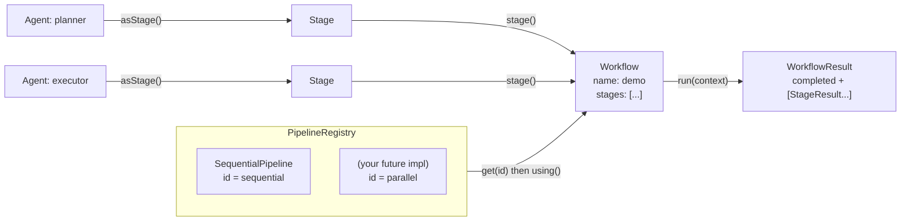
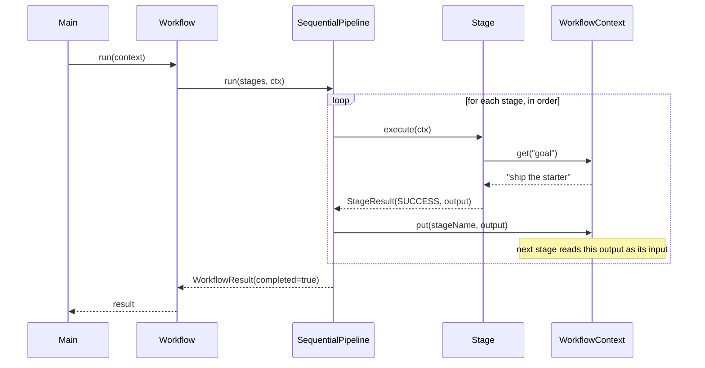
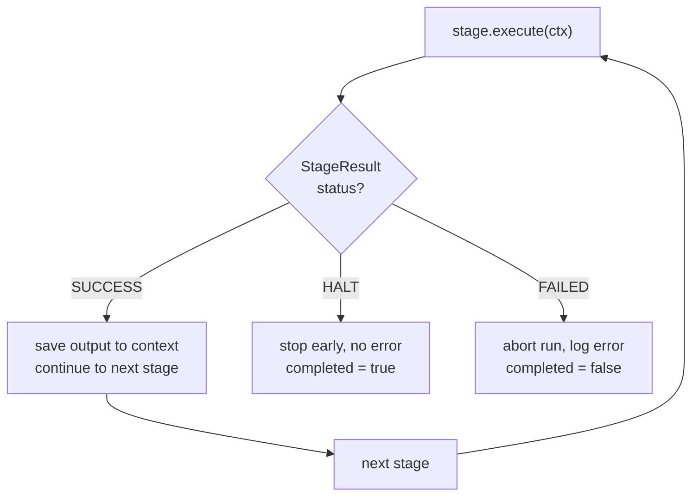

# Myriads Workflow

A starter for a **distributed agentic workflow** engine, built as a Java 21 / Maven application.

This repo intentionally ships a small, clean core. The execution model is pluggable so
new ways of composing and running pipelines can be added incrementally.

## Requirements

- Java 21+
- Maven 3.9+

## Build & run

```bash
mvn clean package          # compile, test, and build a runnable fat jar
java -jar target/myriads-workflow.jar

# or run straight from source:
mvn -q exec:java
```

Run the tests on their own:

```bash
mvn test
```

## Concepts

| Type | Responsibility |
|------|----------------|
| `Stage` | The smallest unit of work in a workflow. |
| `StageResult` | Outcome of a stage: `SUCCESS`, `FAILED`, or `HALT`, plus an output payload. |
| `WorkflowContext` | Thread-safe shared state passed through every stage of a run. |
| `Agent` | An autonomous worker; `asStage()` adapts it into a `Stage`. |
| `Pipeline` | **The main extension point** — a strategy for executing stages. |
| `PipelineRegistry` | Holds the available pipelines, selected by id. |
| `Workflow` | A named list of stages run by a chosen `Pipeline`. |

## How it works

The engine has one core idea: **a `Workflow` is just a list of stages plus a chosen
`Pipeline`.** Swap the pipeline and the same stages run with different semantics —
sequential today; parallel, branching, or distributed later. The three diagrams below
show the same system from three angles.

### 1. Structure — how the pieces relate

`Agent`s are adapted into `Stage`s and wired into a `Workflow`. The `Workflow` borrows
an execution strategy (`Pipeline`) from the `PipelineRegistry`, and running it produces a
`WorkflowResult`.



### 2. Execution — what happens on `workflow.run()`

The chosen pipeline drives the stages. Each stage reads its inputs from the shared
`WorkflowContext` and writes its output back under its own name, so the **next stage
consumes the previous stage's output** — that's the planner → executor chain in the demo.



### 3. Control flow — how `StageResult` steers the run

Every stage returns one of three statuses, and the pipeline reacts to each.



| Status | Meaning | Run outcome |
|--------|---------|-------------|
| `SUCCESS` | Stage finished; output saved to context | continue to next stage |
| `HALT` | Stage asks to stop early, no error | `completed = true`, run stops |
| `FAILED` | Stage threw or returned failure | `completed = false`, run stops |

> When you add a new pipeline, only **diagram 2** changes (e.g. stages fan out across
> threads instead of looping in order). Diagrams 1 and 3 stay the same.

## Adding a new pipeline

Pipelines are how new execution semantics (parallel, branching, distributed, ...) are
introduced. The built-in `SequentialPipeline` is the reference implementation.

1. Implement `Pipeline`:

   ```java
   public final class ParallelPipeline implements Pipeline {
       public static final String ID = "parallel";

       @Override public String id() { return ID; }

       @Override
       public WorkflowResult run(List<Stage> stages, WorkflowContext context) {
           // fan stages out across threads / remote workers, collect results
       }
   }
   ```

2. Register it and select it by id:

   ```java
   PipelineRegistry pipelines = PipelineRegistry.withDefaults()
           .register(new ParallelPipeline());

   Workflow wf = Workflow.named("demo")
           .using(pipelines.get(ParallelPipeline.ID))
           .stage(plannerAgent.asStage())
           .build();
   ```

## Project layout

```
src/main/java/com/myriads/workflow/
├── Main.java                     # demo entry point
├── core/                         # Stage, StageResult, WorkflowContext, Workflow, WorkflowResult
├── agent/                        # Agent abstraction
└── pipeline/                     # Pipeline, PipelineRegistry, SequentialPipeline
```

## Roadmap

- Parallel and branching pipelines
- Distributed execution (dispatch stages to remote workers)
- LLM- and tool-backed agent implementations
- Persistence / replay of `WorkflowContext`
