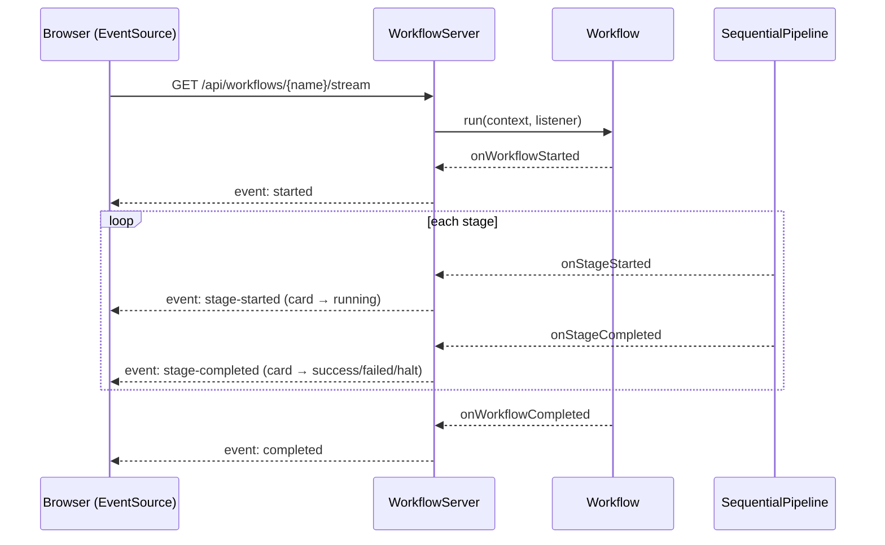
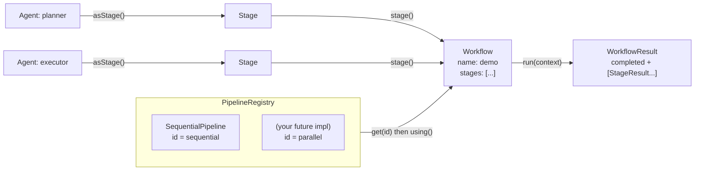
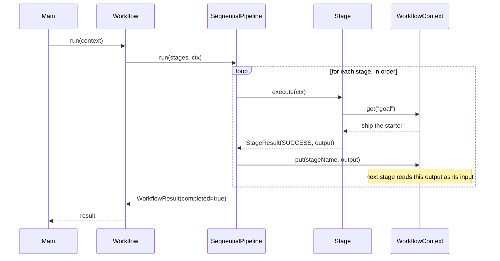
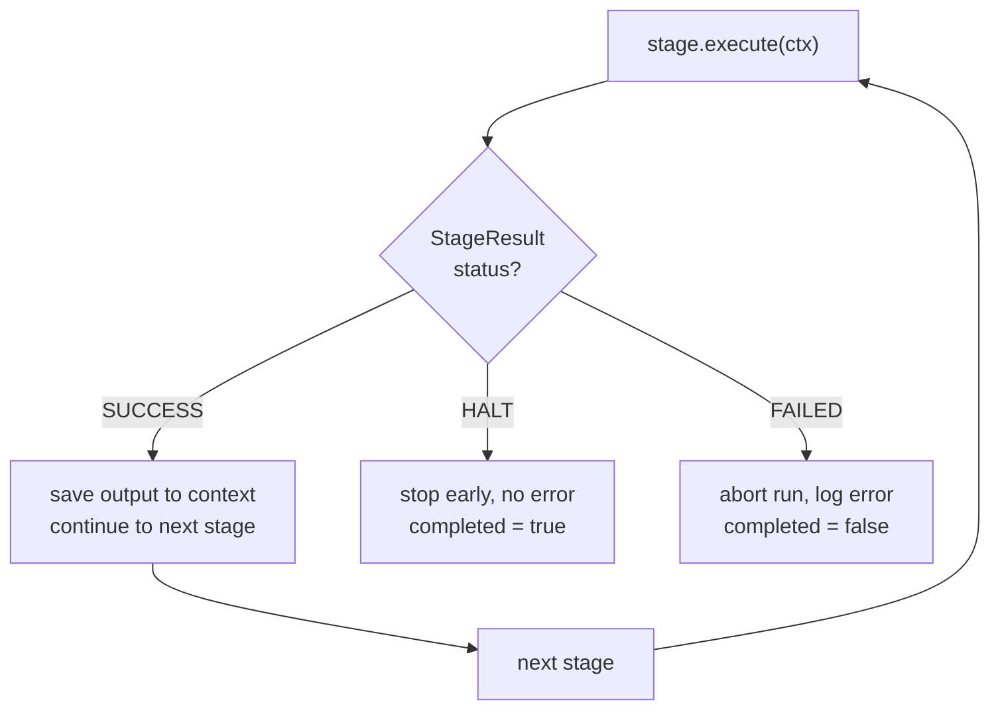

# Myriads Workflow

A starter for a **distributed agentic workflow** engine, built as a Java 21 / Maven application.

This repo intentionally ships a small, clean core. The execution model is pluggable so
new ways of composing and running pipelines can be added incrementally.

## What's inside

- **Pluggable pipelines** — `SequentialPipeline` and `ParallelPipeline` (virtual-thread fan-out), selected by id from a registry.
- **Real AI agents** — `ClaudeAgent` runs Claude API calls as ordinary stages ([Anthropic Java SDK](https://github.com/anthropics/anthropic-sdk-java)).
- **Human-in-the-loop** — stages return `SUCCESS` / `HALT` / `FAILED`, so runs can gate on approval or abort safely.
- **Live web portal** — a dashboard that runs every workflow and lights up each stage in real time over SSE.

## Use cases

The same building blocks — `Stage`/`Agent`, `Pipeline`, `WorkflowContext`, `WorkflowListener` —
map onto a wide range of real-world workflows. The portal's live view makes each one
observable: you watch exactly which step is running and where it stalls.

| Use case | Shape | Engine features it leans on |
|----------|-------|------------------------------|
| **Agentic research / content** | plan → research → draft → review → publish | `ClaudeAgent` crew, context hand-off, `HALT` for human review |
| **Customer onboarding / KYC** | validate → screen → score → approval gate → provision | `HALT` approval gate, abort-and-skip on failure |
| **CI/CD release** | build → test → scan → deploy → smoke-test → promote | `FAILED` aborts before prod; `WorkflowListener` → dashboards |
| **Data / ETL ingestion** | fetch → validate → transform → load → reconcile | `ParallelPipeline` fan-out on transform; safe abort before load |
| **Incident response** | detect → triage → mitigate → notify → verify | `HALT` for severity decisions; live timeline view |
| **Loan / claims / orders** | submit → enrich → policy check → decision → fulfil | all three outcomes: approve / review (`HALT`) / reject (`FAILED`) |
| **LLM agent crews** | specialized agents (researcher, coder, critic) | `ClaudeAgent` per role, shared `WorkflowContext` scratchpad |
| **Parallel scans / multi-region** | run independent steps at once | `ParallelPipeline` (one virtual thread per stage) |

Several of these ship as runnable demo workflows in the portal — see [Web portal](#web-portal).
The **distributed** roadmap item (dispatching stages to remote workers) is the natural next
step for the CI/CD, ETL, and agent-crew cases; the `Pipeline` interface is the seam where it
plugs in.

## Requirements

- Java 21+
- Maven 3.9+

## Build & run

```bash
mvn clean package          # compile, test, and build a runnable fat jar

# run the command-line demo:
java -jar target/myriads-workflow.jar

# or launch the web portal (see below) and open http://localhost:8080 :
java -jar target/myriads-workflow.jar serve 8080
```

Run straight from source instead of building a jar:

```bash
mvn -q exec:java                              # CLI demo
mvn -q exec:java -Dexec.args="serve 8080"     # web portal
```

Run the tests on their own:

```bash
mvn test
```

## AI agents (Claude-backed)

`ClaudeAgent` is a real LLM agent: it builds a prompt from the run context, calls the
Claude API via the [Anthropic Java SDK](https://github.com/anthropics/anthropic-sdk-java),
and returns the model's text as its stage output. Because it implements the same `Agent`
interface, it drops into any pipeline — and the portal — exactly like a hand-written stage.

The bundled **`ai-research-crew`** workflow chains three Claude agents, each reading the
previous one's output from the `WorkflowContext`:

```
planner ──▶ researcher ──▶ writer
(LLM)        (LLM)          (LLM)
```

```java
new ClaudeAgent("planner",
    "You are a planning agent. Given a goal, outline a focused 3-step plan.",
    ctx -> "Goal: " + ctx.get("goal", String.class).orElse("...")).asStage()
```

### Setup

```bash
export ANTHROPIC_API_KEY=sk-ant-...      # required for the Claude agents
export MYRIADS_MODEL=claude-opus-4-8     # optional; this is the default
```

Run from the CLI:

```bash
java -jar target/myriads-workflow.jar ai "design a rate limiter"             # the crew
java -jar target/myriads-workflow.jar ai orchestrate "build a URL shortener" # planner-driven
```

The **`ai-orchestrator`** workflow uses `OrchestratorPipeline`: a planner agent chooses
which specialists (`researcher`, `architect`, `coder`, `reviewer`) to run for the goal,
and only those execute — the rest are skipped. See [Pipelines](#pipelines).

…or open the portal and run **`ai-research-crew`** or **`ai-orchestrator`** live. Without `ANTHROPIC_API_KEY`,
the first stage fails with a clear message (visible in the portal) instead of crashing —
the other demo workflows still run, since they're simulated.

## Web portal

A small, dependency-light portal (built on the JDK's built-in HTTP server) lists the
available workflows and **runs them live, lighting up each stage as it executes**. Start
it with `serve [port]` and open <http://localhost:8080>.

When you run a workflow, the browser opens a [Server-Sent Events](https://developer.mozilla.org/docs/Web/API/Server-sent_events)
stream. The server attaches a `WorkflowListener` to the run and turns each engine callback
into an SSE event, so stage cards transition **pending → running → success / failed / halt**
in real time:



The four bundled demo workflows map to real use cases and exercise every outcome:

| Workflow | Use case | What it shows |
|----------|----------|---------------|
| `research-and-ship` | agentic crew | all stages succeed (green) |
| `kyc-onboarding` | customer onboarding / KYC | **halts** at a manual-review gate (amber) |
| `ci-cd-deploy` | release pipeline | **fails** on a smoke test, skips prod promotion (red) |
| `security-scan` | parallel scans | runs four stages **concurrently** via `ParallelPipeline` |
| `ai-research-crew` | **real Claude agents** | three `ClaudeAgent`s chained planner → researcher → writer |
| `ai-orchestrator` | **planner-driven** | a planner agent picks which specialists run; the rest are skipped (`OrchestratorPipeline`) |

### HTTP API

| Method & path | Purpose |
|---------------|---------|
| `GET /api/workflows` | List workflows and their stage names. |
| `GET /api/workflows/{name}` | One workflow's definition. |
| `POST /api/workflows/{name}/run` | Run it, return the full result as JSON. |
| `GET /api/workflows/{name}/stream` | Run it, streaming live SSE events. |

Both run endpoints accept an optional `?goal=...` query param, which is seeded into the
run's `WorkflowContext`.

## Concepts

| Type | Responsibility |
|------|----------------|
| `Stage` | The smallest unit of work in a workflow. |
| `StageResult` | Outcome of a stage: `SUCCESS`, `FAILED`, or `HALT`, plus an output payload. |
| `WorkflowContext` | Thread-safe shared state passed through every stage of a run. |
| `Agent` | An autonomous worker; `asStage()` adapts it into a `Stage`. |
| `ClaudeAgent` | An `Agent` backed by the Claude API — real LLM work as a drop-in stage. |
| `Pipeline` | **The main extension point** — a strategy for executing stages. |
| `PipelineRegistry` | Holds the available pipelines, selected by id. |
| `Workflow` | A named list of stages run by a chosen `Pipeline`. |
| `WorkflowListener` | Observes a run as it executes; powers the live web portal (and metrics/tracing). |

## How it works

The engine has one core idea: **a `Workflow` is just a list of stages plus a chosen
`Pipeline`.** Swap the pipeline and the same stages run with different semantics —
sequential today; parallel, branching, or distributed later. The three diagrams below
show the same system from three angles.

### 1. Structure — how the pieces relate

`Agent`s are adapted into `Stage`s and wired into a `Workflow`. The `Workflow` borrows
an execution strategy (`Pipeline`) from the `PipelineRegistry`, and running it produces a
`WorkflowResult`.



### 2. Execution — what happens on `workflow.run()`

The chosen pipeline drives the stages. Each stage reads its inputs from the shared
`WorkflowContext` and writes its output back under its own name, so the **next stage
consumes the previous stage's output** — that's the planner → executor chain in the demo.



### 3. Control flow — how `StageResult` steers the run

Every stage returns one of three statuses, and the pipeline reacts to each.



| Status | Meaning | Run outcome |
|--------|---------|-------------|
| `SUCCESS` | Stage finished; output saved to context | continue to next stage |
| `HALT` | Stage asks to stop early, no error | `completed = true`, run stops |
| `FAILED` | Stage threw or returned failure | `completed = false`, run stops |

> When you add a new pipeline, only **diagram 2** changes (e.g. stages fan out across
> threads instead of looping in order). Diagrams 1 and 3 stay the same.

## Pipelines

Pipelines are how new execution semantics (branching, distributed, ...) are introduced.
Two are built in and registered by `PipelineRegistry.withDefaults()`:

| Pipeline | `id` | Semantics |
|----------|------|-----------|
| `SequentialPipeline` | `sequential` | runs stages in order; a `FAILED`/`HALT` stops the run |
| `ParallelPipeline` | `parallel` | runs all stages concurrently (one virtual thread each), waits for all |
| `OrchestratorPipeline` | `orchestrator` | a **planner agent** picks which agents to run at run time; unchosen agents are skipped |

`ParallelPipeline` suits **independent** stages (parallel scans, multi-region deploys, an
agent crew that doesn't share state). Because stages run at once, ordering between them is
undefined — use `SequentialPipeline` when a stage depends on another's `WorkflowContext`
output.

### Adding your own

1. Implement `Pipeline` (the `run(stages, context)` overload defaults to no-op progress;
   implement the 3-arg version to report stage events to the `WorkflowListener`):

   ```java
   public final class BranchingPipeline implements Pipeline {
       public static final String ID = "branching";

       @Override public String id() { return ID; }

       @Override
       public WorkflowResult run(List<Stage> stages, WorkflowContext ctx, WorkflowListener listener) {
           // route to different stages based on a classifier stage's output
       }
   }
   ```

2. Register it and select it by id:

   ```java
   PipelineRegistry pipelines = PipelineRegistry.withDefaults()
           .register(new BranchingPipeline());

   Workflow wf = Workflow.named("demo")
           .using(pipelines.get(BranchingPipeline.ID))
           .stage(plannerAgent.asStage())
           .build();
   ```

## Project layout

```
src/main/
├── java/com/myriads/workflow/
│   ├── Main.java                 # entry: CLI demo, `serve [port]`, or `ai [goal]`
│   ├── core/                     # Stage, StageResult, WorkflowContext, Workflow,
│   │                             #   WorkflowResult, WorkflowListener
│   ├── agent/                    # Agent abstraction; ClaudeAgent + ClaudeClient
│   ├── pipeline/                 # Pipeline, PipelineRegistry, SequentialPipeline,
│   │                             #   ParallelPipeline, OrchestratorPipeline
│   └── web/                      # WorkflowServer, WorkflowCatalog, DemoWorkflows
└── resources/web/index.html      # the single-page portal UI
```

## Roadmap

- ~~Parallel pipeline~~ ✅ (`ParallelPipeline`)
- ~~LLM-backed agents~~ ✅ (`ClaudeAgent`)
- ~~Planner-driven orchestration~~ ✅ (`OrchestratorPipeline`)
- Distributed execution (dispatch stages to remote workers)
- Tool-using agents (give `ClaudeAgent` tools to call)
- Persistence / replay of `WorkflowContext`
- Define and submit workflows from the portal (currently read-only + run)
